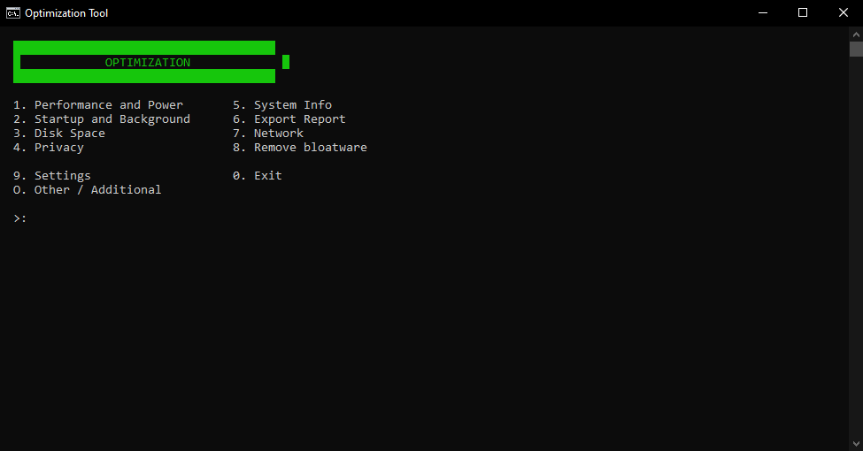
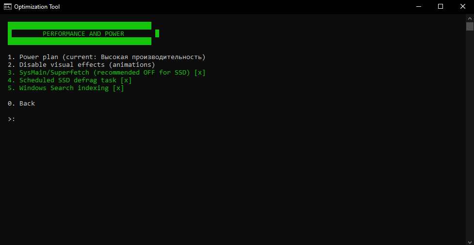
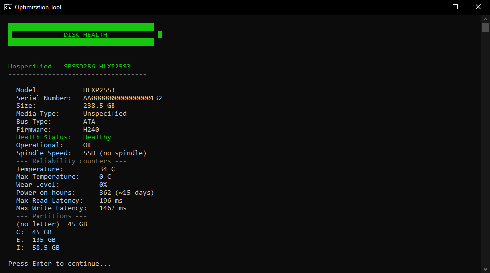
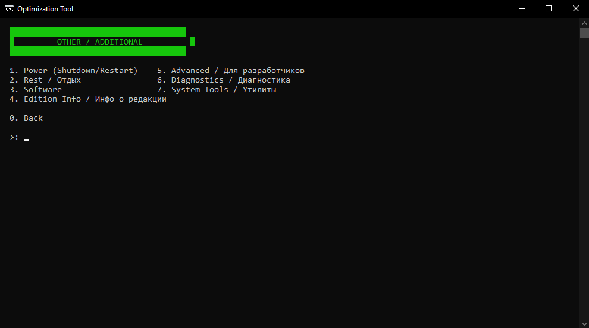
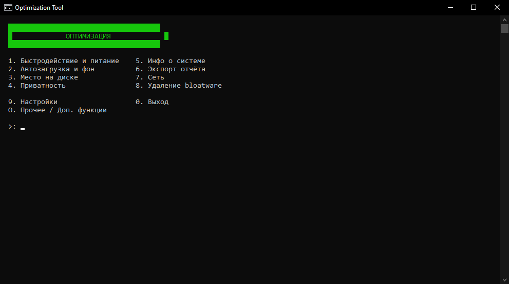
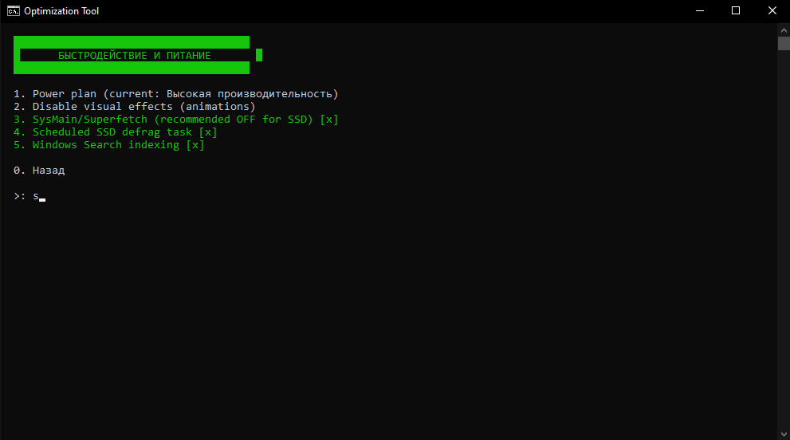
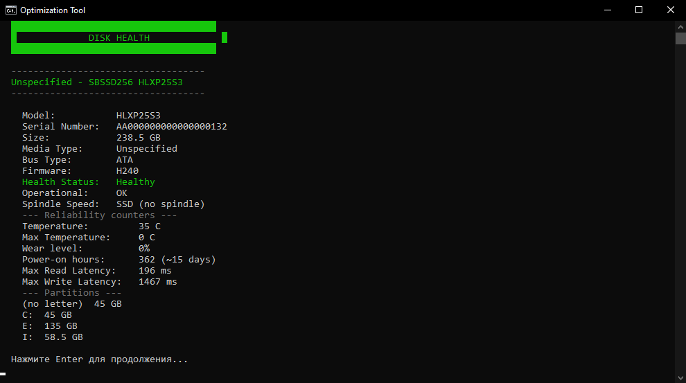
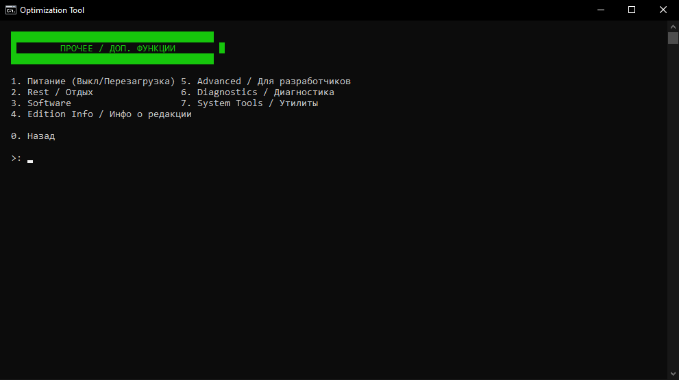

# ⚡ OptiTool-Win10-11

---

## 🇬🇧 [EN] OptiTool - Script for Windows Optimization

OptiTool is a lightweight, modular PowerShell utility for optimizing, cleaning, and diagnosing Windows 10 and 11 — all through a simple console menu.

### 💻 Requirements
* **OS:** Windows 10 or 11
* **Environment:** PowerShell 5.1+
* **Rights:** Run as Administrator

### 🚀 Quick Start
1. Download the archive from the **Releases** tab.
2. Right-click `start.bat` and choose **Run as administrator**.

  
   <b>[EN] Main menu</b>

### ⚡ Key Features
* **Performance:** Power plan management, disabling unnecessary services (SysMain, indexing) and visual effects.
* **Startup:** Manage startup items via registry, Task Scheduler, and background app control.
* **Disk & Cleanup:** Clean `TEMP`, `Windows.old`, update cache, and built-in multi-disk S.M.A.R.T. health check.
* **Privacy:** Disable Windows telemetry, advertising ID, and background trackers.
* **System Info:** Detailed CPU/GPU specs, live resource snapshot, driver list, and full export report.

  
   <b>[EN] Performance and Power</b>

* **Network:** Resource monitoring, DNS/TCP-IP reset, ping test by country, and Speedtest.
* **Bloatware Removal:** Quickly remove built-in clutter (Xbox, Weather, News, etc.).

  
   <b>[EN] Disk health / S.M.A.R.T.</b>

* **Other menu:** All extra tools grouped in one place —
  * **Power:** shutdown/restart with timer and message templates.
  * **Advanced:** DISM cleanup (`/ResetBase`), paging file settings, hibernation toggle, and MAS launcher.
  * **Diagnostics:** on-demand download of Fastfetch, Smartctl, and Sysinternals tools (Autorunsc, Handle, AccessChk).
  * **Software:** quick download links for Chrome, Firefox, Telegram, Viber, VLC, 7-Zip, and benchmarking tools (CPU-Z, GPU-Z, FurMark, MSI Afterburner, AIDA64).
  * **System Tools:** one-click access to `diskmgmt`, `services.msc`, `devmgmt`, `regedit`, `msinfo32`, `dxdiag`, and Safe Mode toggle.
  * **Edition Info:** detects your exact Windows edition/build, fixes "managed by your organization" labels on LTSC, and offers Windows 11-specific tweaks (classic context menu, disable widgets/Copilot).
  * **Rest:** Snake (WASD or Arrow keys), Guess the Number, Clicker (with upgrades and a save file), and a CPS test.

  
   <b>[EN] Other menu</b>

* **Self-Update:** Checks all GitHub Releases (not just the latest), shows each version's own changelog, downloads and restarts on its own.

### ⚠️ Disclaimers
* **System Changes:** The script modifies registry and services. Use advanced features with care.
* **Third-Party Tools:** Tools like **Speedtest**, **Fastfetch**, **Smartctl**, **Sysinternals**, and software installers are **not stored** in this repository. The script downloads them directly from official sources on-demand.
* **Activation (MAS):** The script provides quick access to [Massgrave (MAS)](https://github.com/massgravel/Microsoft-Activation-Scripts) — an open-source third-party project. All activation code belongs to its original authors.
* **AIDA64:** Free 30-day trial. Mainly useful for initial stress-testing and sensor checks.

---

## 🇷🇺 [RU] OptiTool - Скрипт для оптимизации Windows

OptiTool — это небольшая и удобная утилита на PowerShell для настройки, очистки и диагностики Windows 10 и 11. Всё работает через понятное консольное меню.

### 💻 Что нужно для запуска
* **ОС:** Windows 10 или 11
* **Среда:** PowerShell 5.1+
* **Права:** Запуск от имени администратора

### 🚀 Как запустить
1. Скачай архив из вкладки **Releases**.
2. Нажми правой кнопкой на `start.bat` и выбери **Запуск от имени администратора**.

  
   <b>[RU] Главное меню</b>

### ⚡ Что умеет скрипт
* **Быстродействие:** Настройка схем питания, отключение лишних служб (SysMain, индексация) и визуальных эффектов.
* **Автозагрузка:** Управление автозапуском через реестр, планировщик и отключение фоновых приложений.
* **Очистка и диски:** Очистка `TEMP`, `Windows.old`, кэша обновлений и встроенная проверка S.M.A.R.T. на нескольких дисках.
* **Приватность:** Отключение телеметрии, рекламного ID и фоновых трекеров.
* **Инфо о системе:** Подробные данные CPU/GPU, снэпшот ресурсов в реальном времени, список драйверов и полный экспорт отчёта.

  
   <b>[RU] Быстродействие и питание</b>

* **Сеть:** Мониторинг ресурсов, сброс DNS/TCP-IP, пинг-тест по странам и Speedtest.
* **Удаление блоатвера:** Быстрый снос встроенного мусора (Xbox, Погода, Новости и т.д.).

  
   <b>[RU] Здоровье диска / S.M.A.R.T.</b>

* **Меню «Прочее»:** Все дополнительные инструменты в одном месте —
  * **Питание:** выключение/перезагрузка с таймером и шаблонами сообщений.
  * **Advanced:** очистка DISM (`/ResetBase`), файл подкачки, гибернация и запуск MAS.
  * **Диагностика:** скачивание Fastfetch, Smartctl и утилит Sysinternals по требованию.
  * **Софт:** быстрое скачивание Chrome, Firefox, Telegram, Viber, VLC, 7-Zip и тестовых утилит (CPU-Z, GPU-Z, FurMark, MSI Afterburner, AIDA64).
  * **Системные утилиты:** быстрый доступ к `diskmgmt`, `services.msc`, `devmgmt`, `regedit`, `msinfo32`, `dxdiag` и Безопасному режиму.
  * **Инфо о редакции:** определяет точную редакцию/сборку Windows, чинит плашку «управляется организацией» на LTSC, и предлагает твики для Windows 11 (классическое контекстное меню, отключение виджетов/Copilot).
  * **Отдых:** Змейка (WASD или стрелки), Угадай число, Кликер (с прокачкой и сохранением) и тест КПС.

  
   <b>[RU] Меню «Прочее»</b>

* **Самообновление:** Проверяет ВСЕ релизы на GitHub (а не только последний), показывает changelog каждой версии, скачивает и перезапускается сам.

### ⚠️ Важное примечание
* **Изменения в системе:** Скрипт меняет реестр и службы. Используй продвинутые функции с умом.
* **Сторонние утилиты:** Инструменты вроде **Speedtest**, **Fastfetch**, **Smartctl**, **Sysinternals** и софт **не хранятся** в репозитории. Скрипт качает их с официальных сайтов только тогда, когда ты сам выбираешь их в меню.
* **Активация (MAS):** Скрипт лишь даёт быстрый доступ к [Massgrave (MAS)](https://github.com/massgravel/Microsoft-Activation-Scripts) — это сторонний проект, весь код активации принадлежит их авторам.
* **AIDA64:** Бесплатный 30-дневный триал. В основном полезна для первичного стресс-теста и проверки датчиков.

---

## 👨‍💻 Credits / Авторство

* **Developer / Разработчик:** [@ghostsmash](https://github.com/ghostsmash)
* **Code assistance / Помощь с кодом:** Claude & Gemini
